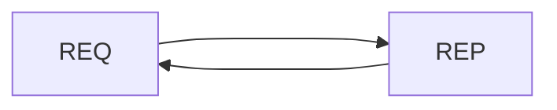
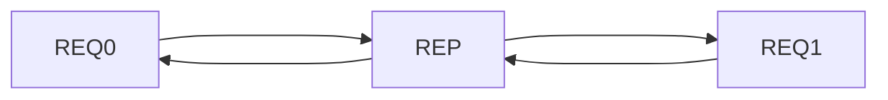
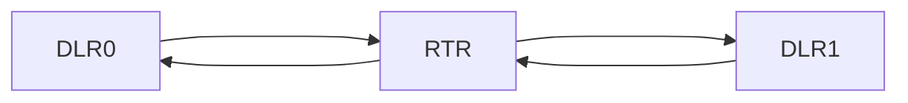
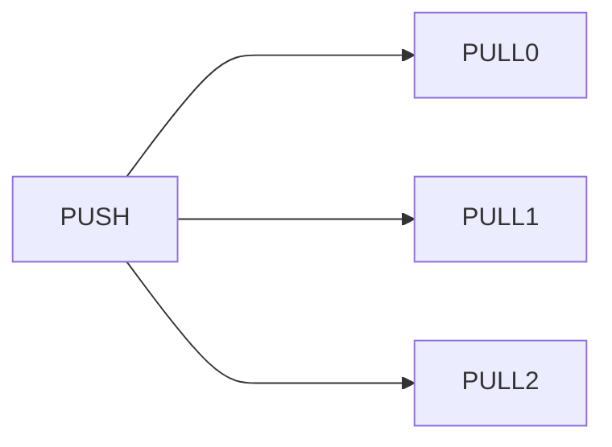
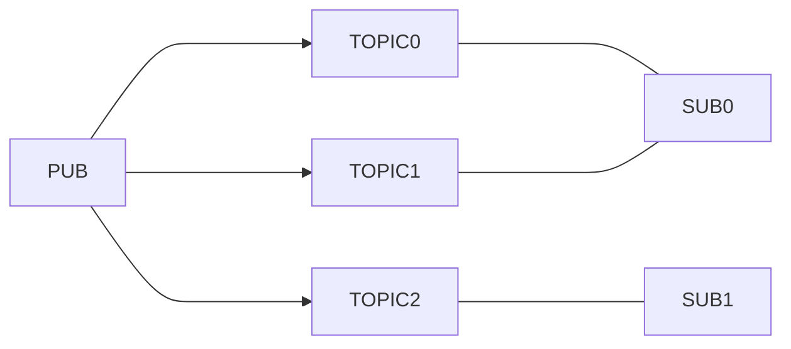

# ZeroMQ Essentials

ZeroMQ is an open-source messaging library which allows N-to-N socket connections with different pattern such as request-reply, publisher-subscriber, task distribution, producer-consumer and more...

It aims to be fast which make it perfect to use for clustered-applications.

https://zeromq.org/

## Patterns

## Request-Reply

Simple REQ-REP.


Using the REQ-REP pattern implies to use a specific sequence of send and receive functions in a particular order depending on whether it is a REQ or a REP socket.

Also a REP socket will always bind whereas a REQ socket will always connect to the REP socket.

Exemple of a REP socket pseudo code:
```
bind(url)
recv(data)
send(data)
```


Exemple of a REQ socket pseudo code:
```
connect(REP_socket_url)
send(data)
recv(data)
```

:warning: The ```recv()``` function is blocking in this pattern, so it will block until data is received.

It is also possible to have a REP socket connected to multiple REQ sockets. The REP socket will always respond to the REQ socket from which it received the data.


## Dealer-Router

Unlike the REQ-REP pattern, the DLR-RTR pattern doesn't have to follow the send/recv cycle. Besides, it is possible to connect Dealers to Dealers, Routers to Routers and Dealers to Routers which makes it more powerful than the REQ-REP one. 



The router keeps track of Dealers identity. Besides that, it also assigns a default identity to every socket that it receives messages from. It is possible to assign custom identities which make it more understandable. The messages are multi-part with the identity and the payload(actual data).

## Pair

The PAIR pattern is a one to one communication pattern. You can not have more than two sockets exchanging together.
If you try to connect a third socket to an existing PAIR socket communication, and try to send data, the data won't be received and therefore it will be ignored.

## Push-Pull

The PUSH-PULL pattern is a Producer-Consumer pattern. The PUSH socket can not receive messages. The messages are enqueued and PUSHED towards "workers" or "clients" that PULL. Let's assume that there are three messages (m0, m1, m2) in the queue on the "server" side and the server PUSH messages towards three clients (cl0, cl1, cl2) through the PUSH socket, each client will PULL and get one message (cl0 get msg2, cl1 gets msg1 and cl2 gets msg0) from the queue, once a message is PUSHED, it is removed from the queue and therefore two clients can not have the same message.



This pattern makes a lot of sense in a server-client scenario where the server has jobs to be executed by workers(clients), and each client gets a job assigned by the server.

## Publisher-Subscriber

The PUB-SUB pattern is a pattern where the publisher creates a topic and subscribers can subscribe to that topic and therefore will only receive the messages from the topic they subscribed on.



## Messages

 At minimum use JSON format for messages, but the best would be binary-serialization.
 
 ### Binary-serialization
 Using binary serialization enforce a sort of contract between communicators. It guarantees the correctness of the information and make it faster than JSON.
 
 https://developers.google.com/protocol-buffers
 
 
## Encription

 The communication between sockets are not encrytped and therefore can be seen and captured by a packet analyzer, however ZeroMQ can use the sodium library to encrypt the messages.
 
 https://libsodium.gitbook.io/doc/
